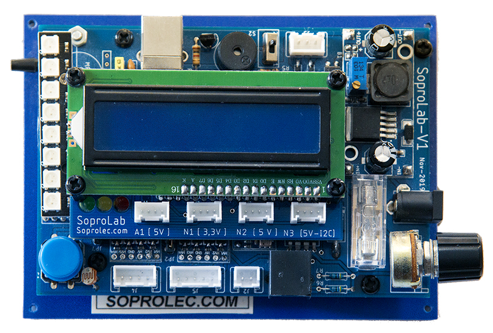

### 17/12/2020 -> INFORMATION : False et 0 -> pareil ou pas ?!

Vous pouvez télécharger des exemples de code en microPython pour différentes activités. 
Cependant, il se peut que vous soyez confrontés à des erreurs lors des exécutions. 
 
En effet, nous sommes souvent amenés à faire des **tests de comparaison** avec la valeur <code>False</code> ou <code>True</code>. 
**Avec la version microPython 1.11, False est équivalent à 0**.

On peut donc faire un test <code>if Bouton.value()==False</code> pour savoir si le bouton poussoir est enfoncé ou non. 
Etant donné que False est égal à 0, on peut faire le test <code>if Bouton.value()==0</code>, le résultat serait le même. 
>  <b>OR</b> 
Avec la version microPython 1.12, **False N'EST PAS ÉQUIVALENT À 0 !!!**

Le test <code>if Bouton.value()==False</code> est donc toujours FAUX !!!. 
**Il est alors nécessaire de remplacer False par 0.** 
 
Ainsi, si vos cartes ont un microPython 1.12 d'embarqué, il faut remplacer tous les <code>False</code> par <code> 0 </code>
 
 
---
 
 

# Parce que la pédagogie ne doit pas s'adapter à un microcontrôleur mais le microcontrôleur doit être au service de la pédagogie.

La carte SoproLab permet de mettre facilement en oeuvre des dispositifs expérimentaux en intégrant des microcontrôleurs programmés en Python.

La carte est commercialisée par l'entreprise soprolec ( basée au Mans ).

Une notice d'utilisation de la carte est disponible dans le fichier : 
<b><a href="https://github.com/SoproLab/Soprolab/blob/master/Notice_Utilisation.pdf"> Notice_Utilisation.pdf </a></b> 

Vidéo de présentation de la carte : https://j-chouteau.org/index.php/carte-soprolab/

Vous trouverez ici des exemples de programmes en Python pour utiliser la carte SoproLab :
- dans des expériences de Physique - Chimie en seconde et spécialité physique
- dans des activités de Sciences et Laboratoire de seconde générale et technologique
- dans des activités de Sciences Numériques et Technologie

Vous pouvez directement télécharger les programmes [ Download zip ] dans les différents dossiers ou bien afficher le code source [ raw ] et le mettre en oeuvre.

et d'autres activités à venir ...

Contact : https://j-chouteau.org/index.php/contact/

