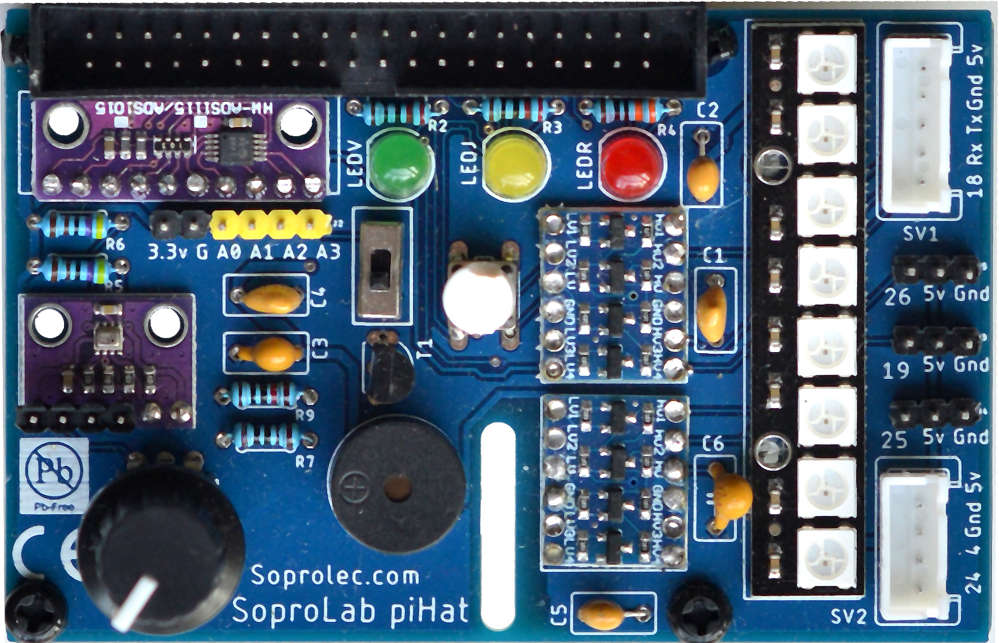

# Carte d'extension pour Raspberry Pi

Cette carte a été développée pour répondre à des besoins pédagogiques.

Exemple : projet de développement d'Interface Homme Machine en NSI.

Elle permet de développer des activités pédagogiques avec une approche plus concrète.

**Elle comporte :**
- trois led verte / jaune / rouge
- un bouton poussoir (mesure en tout ou rien)
- un BME280 : capteur i2C température et pression atmosphériques, humidité relative de l'air ambiant,
- un ADS1015 : convertisseur analogique/numérique 12 bits / 4 entrées
- un potentiomètre (mesure d'une tension analogique)
- huit led NeoPixel (utilisation de listes de tuples [ (rouge, vert, bleu) x 8 ]
- un buzzer multifréquence 
- des adaptateurs de tension 3,3V <-> 5v pour brancher des capteurs, servo moteurs, ...

**Connecteurs disponibles :**
- connecteur i2c en 3,3V
- connecteur XH-5points en 5V (extension Rx-Tx + commande)
- connecteur XH-4points en 5V
- 3 connecteurs SIL-3pts en 5V (PWM pour servo moteurs, ou capteurs / actionneurs / ...)

Des modifications peuvent être développées :
- connecteurs grove par exemple,
 
à étudier en fonction des besoins