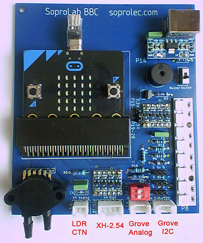

# Carte d'adaptation pour carte microbit BBC afin de l'utiliser dans des démarches expérimentales.

La carte SoproLab-BBC permet permet de mettre facilement en oeuvre des dispositifs expérimentaux en intégrant des microcontrôleurs programmés en Python.

Cette carte d''adaptation pour microbit est fabriquée et commercialisée par l'entreprise soprolec ( basée au Mans ).

Vidéo de présentation de la carte : https://j-chouteau.org/index.php/carte-soprolab/

Vous trouverez ici des exemples de programmes en Python pour utiliser la carte SoproLab :

Contact : https://j-chouteau.org/index.php/contact/

